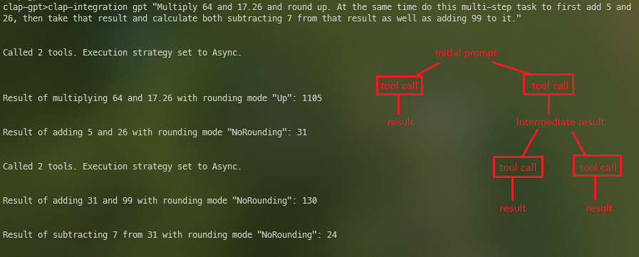

# openai-func-enums:

openai-func-enums is an unofficial Rust library for OpenAI. It contains a set of procedural macros and other functions, to be used in conjunction with [async-openai](https://github.com/64bit/async-openai), that make it easy to use enums to compose "function" tool types that can be passed to OpenAI's chat completions api.

If you want to see a larger example where there are more function definitions than there is context window, check out [dripgrep](https://github.com/frankfralick/dripgrep).


### Why?

The motivation for this was the need to leverage OpenAI function calls for logic control flow. If you have a lot of "function calls" to deal with, especially if they share argument types, the out-of-the-box way of doing this is unwieldy with using just async-openai. This library allows returns to be deserialized as instances of structs, the types of which the macros produce, so that you can easily take the response and match on the variants selected by the model.

## Features

- **Enums are the greatest:** openai-func-enums asks you to define an enum to represent possible "functions" to be passed to the OpenAI API, with each variant representing a function, with the fields on these variants indicating the required arguments. Each field can be either an enum, a value type, or a vector of value types, with the variants of the enum fields determining the allowed choices that can be passed to the OpenAI API.

- **Token Tallying:** The library keeps a tally of the token count associated with each "function" defined through the enums.

- **Embedding-Based Function Filtering:** Building your application with the feature `--compile_embeddings_all` will get embeddings for your functions and bake them into a zero-copy archive available at runtime. A per request token budget for tool definitions will be used to limit tools to what is most similar to the prompt. You can also specify functions that must be included no matter their similarity rank. A feature flag for updating changes only is there, but doesn't work yet because it is more involved. It uses [rkyv](https://github.com/rkyv/rkyv)(zero-copy deserialization framework) for serialization/deserialization.

- **clap-gpt:** This library provides macros and traits to allow you to turn an existing clap application into a clap-gpt application without a ton of extra ceremony required. See the usage section for an example.

- **Parallel tool calls:** If OpenAI elects to call more than one of the available tools at the same time, this library will process them based on an execution strategy you specify. It can run them asynchronously, synchronously, or on os threads depending on your need. The clap integration example goes into more detail about parallel tool calls.

## Usage

**Note: This library requires async-openai, which requires that you have your api key in an environment variable called `OPENAI_API_KEY`.

First, define an enum to hold the possible functions, with each variant being a function. The fields on these variants indicate the required arguments, and each field must also be an enum. The variants of these fields determine the allowed choices that can be passed to OpenAI's API. For example, here's a function definition for getting current weather:

```rust
#[derive(Debug, ToolSet)]
pub enum FunctionDef {
    /// "Get the current weather in the location closest to the one provided location"
    GetCurrentWeather {
        location: Location,
        temperature_units: TemperatureUnits,
    },

    GPT {
        prompt: String,
    },
}
```

Each argument must derive EnumDescriptor and VariantDescriptor, and must have the attribute macro arg_description. For example, a `Location` argument might look like this:

```rust
#[derive(Clone, Debug, Deserialize, EnumDescriptor, VariantDescriptors)]
#[arg_description(description = "The only valid locations that can be passed.")]
pub enum Location {
    Atlanta,
    Boston,
    // ...
}
```

Then, you can use these definitions to construct a request to the OpenAI API. The thing to note here is that the user prompt asks about the weather at the center of the universe, Swainsboro, GA, which doesn't correspond to any valid locations we provided it, and it returns the closest valid option, Atlanta. 

In this examle the prompt also asks for the weather in two additional locations. Because I'm using a model that supports "parallel tool calls", it detects that it can make these three calls all at once and does so.

```rust
#[tokio::main]
async fn main() -> Result<(), Box<dyn std::error::Error>> {
    let (sender, receiver) = mpsc::channel(100);
    let logger = Arc::new(Logger { sender });
    spawn(logger_task(receiver));
    let logger_clone = logger.clone();

    (FunctionDef::GPT {
        prompt: "What's the weather like in Swainsboro, GA, Nashville, TN, Los Angeles, CA?"
            .to_string(),
    })
    .run(ToolCallExecutionStrategy::Async, None, logger_clone)
    .await
    .map_err(|e| {
        Box::new(CommandError::new(&format!(
            "Command failed with error: {}",
            e
        )))
    })?;

    Ok(())
}
```
It is important to note that the call to "run" above is defined by the RunCommand trait and you must implement it, and you need a "GPT" variant that takes a String prompt.

This creates a request with the `GetCurrentWeather` function, and two arguments: `Location` and `TemperatureUnits`.

### Integration with clap:
Depending on how your existing clap application is structured, this library can provide an easy mechanism to allow use of your command line tool with natural language instructions. It supports value type arguments and enums. How well it performs will depend on which model you use, the system messages, and function descriptions.


If your application follows the pattern where you have an enum that derives clap's `Subcommand` then this library can be added with little friction. This example has a variant `CallMultiStep`, that is there just to demonstrate handling multiple sequential or parallel steps at once.

A word of caution: Recursion and AI probably aren't a good combo without guarding against it running away from you. It is entirely possible to make a prompt using the example below that will keep making requests to OpenAI.


```rust
#[derive(Parser)]
#[clap(author, version, about, long_about = None)]
#[clap(propagate_version = true)]
struct Cli {
    #[clap(subcommand)]
    command: Commands,
}

#[derive(Debug, Subcommand, ToolSet)]
pub enum Commands {
    /// Adds two numbers
    Add {
        a: f64,
        b: f64,
        rounding_mode: RoundingMode,
    },
    /// Subtracts two numbers
    Subtract {
        a: f64,
        b: f64,
        rounding_mode: RoundingMode,
    },
    /// Multiplies two numbers
    Multiply {
        a: f64,
        b: f64,
        rounding_mode: RoundingMode,
    },
    /// Divides two numbers
    Divide {
        a: f64,
        b: f64,
        rounding_mode: RoundingMode,
    },
    /// CallMultiStep is designed to efficiently process complex, multi-step user requests. It takes an array of text prompts, each detailing a specific step in a sequential task. This function is crucial for handling requests where the output of one step forms the input of the next. When constructing the prompt list, consider the dependency and order of tasks. Independent tasks within the same step should be consolidated into a single prompt to leverage parallel processing capabilities. This function ensures that multi-step tasks are executed in the correct sequence and that all dependencies are respected, thus faithfully representing and fulfilling the user's request."
    CallMultiStep {
        prompt_list: Vec<String>,
    },
    GPT {
        prompt: String,
    },
}
```

The library provides a trait called "RunCommand", which makes you implement a "run" function. This function returns a result of Option<String>, and this is only for cases where you have more than one step.  In this example I'm showing how you can have value type arguments, as well as enums. If you want to define an enum that will serve as an argument to function calls, they need to derive clap's `ValueEnum`, as well as the other `EnumDescriptor` and `VariantDescriptors` provided by this library.

#### Parallel Tool Calls
Currently the "run" function for RunCommand takes a single argument called that is an enum ToolCallExecutionStrategy. This sets how parallel tool calls will get executed if a prompt results in more than one. Running with `ToolCallExecutionStrategy::Async` will run each tool call it can concurrently and this is what should be used is most cases. For now at least, selecting "Parallel" will run just the initial parallel calls on their own os threads. Subsequent parallel calls made in the course of a multi-step request will not spawn new os threads and they will run concurrently.

#### Embeddings
If you really want to do your part in hastening the end of humanity, you are going to want to build a really featureful system with lots of things that the LLM can do. This will create a problem for you as LLM's mind is like a butterfly. Even if the context window can hold it, give it too much to choose from and it will become more unreliable that it already is.

But even if your set of functions isn't that large, how well it does can be really 




```rust
#[async_trait]
impl RunCommand for Commands {
    async fn run(
        &self,
        execution_strategy: ToolCallExecutionStrategy,
        _arguments: Option<Vec<String>>,
        logger: Arc<Logger>,
    ) -> Result<
        (Option<String>, Option<Vec<String>>),
        Box<dyn std::error::Error + Send + Sync + 'static>,
    > {
        let max_response_tokens = 1000_u16;
        let request_token_limit = 4191;
        let model_name = "gpt-4-1106-preview";
        let system_message = "You are an advanced function-calling bot, adept at handling complex, \
                              multi-step user requests. Your role is to discern and articulate \
                              each step of a user's request, especially when it involves sequential \
                              operations. Use the CallMultiStep function for requests that require \
                              sequential processing. Each step should be described in a separate \
                              prompt, with attention to whether the steps are independent or \
                              interdependent. For interdependent steps, ensure each prompt \
                              accurately represents the sequence and dependencies of the tasks. \
                              Remember, a single step may encompass multiple tasks that can be \
                              executed in parallel. Your goal is to capture the entire scope of the \
                              user's request, structuring it into an appropriate sequence of function \
                              calls without omitting any steps. For example, if a user asks to add 8 \
                              and 2 in the first step, and then requests the result to be multiplied \
                              by 7 and 5 in separate tasks of the second step, use CallMultiStep with \
                              two prompts: the first for addition, and the second combining both \
                              multiplication tasks, recognizing their parallel nature.";

        match self {
            Commands::Add {
                a,
                b,
                rounding_mode,
            } => {
                let result = rounding_mode.round(a + b);
                println!(
                    "Result of adding {} and {} with rounding mode {:#?}: {}",
                    a,
                    b,
                    rounding_mode.variant_name_with_token_count().0,
                    result
                );
                return Ok((Some(result.to_string()), None));
            }
            Commands::Subtract {
                a,
                b,
                rounding_mode,
            } => {
                let result = rounding_mode.round(a - b);
                println!(
                    "Result of subtracting {} from {} with rounding mode {:#?}: {}",
                    b,
                    a,
                    rounding_mode.variant_name_with_token_count().0,
                    result
                );
                return Ok((Some(result.to_string()), None));
            }
            Commands::Multiply {
                a,
                b,
                rounding_mode,
            } => {
                let result = rounding_mode.round(a * b);
                println!(
                    "Result of multiplying {} and {} with rounding mode {:#?}: {}",
                    a,
                    b,
                    rounding_mode.variant_name_with_token_count().0,
                    result
                );
                return Ok((Some(result.to_string()), None));
            }
            Commands::Divide {
                a,
                b,
                rounding_mode,
            } => {
                if *b != 0.0 {
                    let result = rounding_mode.round(a / b);
                    println!(
                        "Result of dividing {} by {} with rounding mode {:#?}: {}",
                        a,
                        b,
                        rounding_mode.variant_name_with_token_count().0,
                        result
                    );
                    return Ok((Some(result.to_string()), None));
                } else {
                    return Err(Box::new(CommandError::new("Cannot divide by zero")));
                }
            }
            Commands::CallMultiStep { prompt_list } => {
                let _ = logger
                    .sender
                    .send(String::from("this is the prompt list"))
                    .await;
                let message = format!("{:#?}", prompt_list);
                let _ = logger.sender.send(message).await;

                let prior_result = Arc::new(Mutex::new(None));

                let command_args_list: Vec<String> = Vec::new();
                let command_args = Arc::new(Mutex::new(Some(command_args_list)));
                for (i, prompt) in prompt_list.iter().enumerate() {
                    let prior_result_clone = prior_result.clone();
                    let command_args_clone = command_args.clone();
                    let logger_clone = logger.clone();

                    match i {
                        0 => {
                            CommandsGPT::run(
                                &prompt.to_string(),
                                model_name,
                                request_token_limit,
                                max_response_tokens,
                                Some(system_message.to_string()),
                                prior_result_clone,
                                execution_strategy.clone(),
                                command_args_clone,
                                None,
                                None,
                                logger_clone,
                            )
                            .await?
                        }

                        _ => {
                            let prior_result_guard = prior_result.lock().await;
                            if let Some(prior) = &*prior_result_guard {
                                let new_prompt =
                                    format!("The prior result was: {}. {}", prior.clone(), prompt);
                                drop(prior_result_guard);

                                CommandsGPT::run(
                                    &new_prompt,
                                    model_name,
                                    request_token_limit,
                                    max_response_tokens,
                                    Some(system_message.to_string()),
                                    prior_result_clone,
                                    execution_strategy.clone(),
                                    command_args_clone,
                                    None,
                                    None,
                                    logger_clone,
                                )
                                .await?
                            } else {
                                *prior_result.lock().await = None;
                            }
                        }
                    }
                }
                let result = String::from("Ok.");
                return Ok((Some(result), None));
            }
            Commands::GPT { prompt } => {
                let prompt_embedding = single_embedding(prompt, FUNC_ENUMS_EMBED_MODEL).await?;

                let prior_result = Arc::new(Mutex::new(None));
                let command_args = Arc::new(Mutex::new(None));
                let embed_path = Path::new(FUNC_ENUMS_EMBED_PATH);
                let mut ranked_func_names = vec![];
                let logger_clone = logger.clone();

                if embed_path.exists() {
                    let mut file = File::open(embed_path).unwrap();
                    let mut bytes = Vec::new();
                    file.read_to_end(&mut bytes).unwrap();

                    let archived_funcs =
                        rkyv::check_archived_root::<Vec<FuncEmbedding>>(&bytes).unwrap();
                    ranked_func_names = rank_functions(archived_funcs, prompt_embedding).await;
                }

                let required_funcs = vec![String::from("CallMultiStep")];

                CommandsGPT::run(
                    prompt,
                    model_name,
                    request_token_limit,
                    max_response_tokens,
                    Some(system_message.to_string()),
                    prior_result,
                    execution_strategy.clone(),
                    command_args,
                    Some(ranked_func_names),
                    Some(required_funcs),
                    logger_clone,
                )
                .await?;
            }
        };

        Ok((None, None))
    }
}

#[derive(Clone, Debug, Deserialize, EnumDescriptor, VariantDescriptors, ValueEnum)]
#[arg_description(description = "Different modes to round a number.")]
pub enum RoundingMode {
    NoRounding,
    Nearest,
    Zero,
    Up,
    Down,
}

impl RoundingMode {
    pub fn round(&self, number: f64) -> f64 {
        match *self {
            RoundingMode::NoRounding => number,
            RoundingMode::Nearest => number.round(),
            RoundingMode::Zero => number.trunc(),
            RoundingMode::Up => number.ceil(),
            RoundingMode::Down => number.floor(),
        }
    }
}

#[tokio::main]
async fn main() -> Result<(), Box<dyn std::error::Error>> {
    let (sender, receiver) = mpsc::channel(100);
    let logger = Arc::new(Logger { sender });
    spawn(logger_task(receiver));
    let logger_clone = logger.clone();

    let cli = Cli::parse();

    let start_time = Instant::now();

    cli.command
        .run(ToolCallExecutionStrategy::Async, None, logger_clone)
        .await
        .map_err(|e| {
            Box::new(CommandError::new(&format!(
                "Command failed with error: {}",
                e
            )))
        })?;

    let duration = start_time.elapsed();
    println!("Command completed in {:.2} seconds", duration.as_secs_f64());

    Ok(())
}
```
